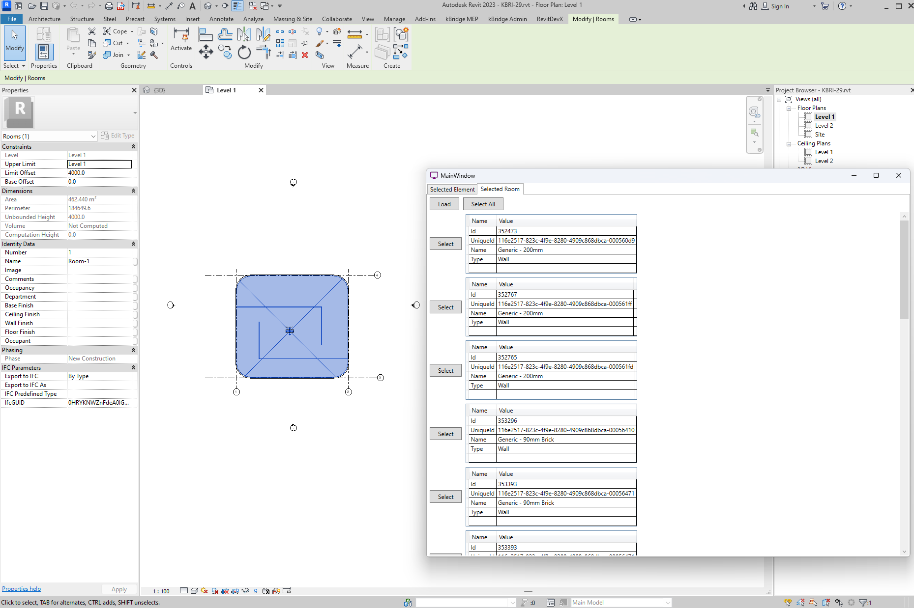

# RevitDevX

This is a Revit add-in for exploring the data used in development.

## Element Parameters

1. Launch Browser.

2. Select Element, click "Load".

## Room's boundary

1. Launch Browser.
2. Select "Selected Room" tab.
3. Select Room, click "Load"

4. Click "Select" or "Select All" to highlight the boundary elements in Revit.
